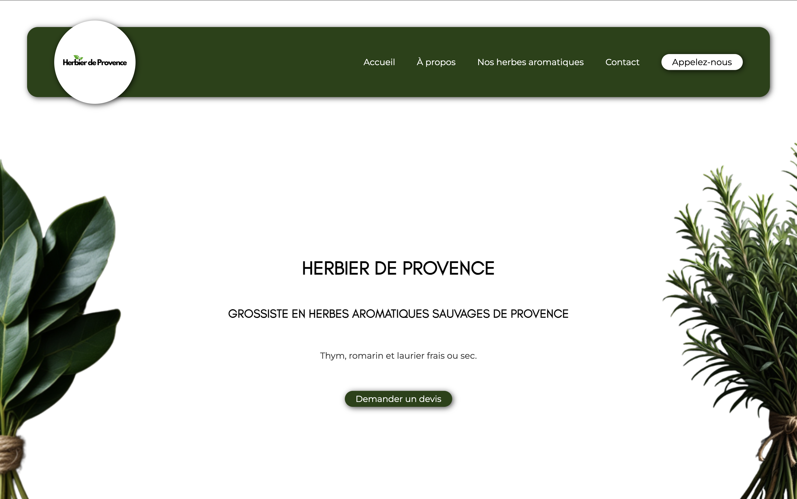

### Site vitrine dédié aux herbes aromatiques sauvages de Provence

 

---

## ✨ À propos du projet

**Herbier de Provence** est un site vitrine conçu pour **présenter les herbes aromatiques sauvages** que l'entreprise commercialise et **faciliter la prise de contact**.

Ce projet a été conçu dans le but de proposer un site vitrine moderne, intuitif et facilement maintenable.

---

## 🎯 Objectifs

* 🌿 Valoriser les herbes aromatiques sauvages commercialisées
* 📖 Présenter les produits et leur origine
* 📩 Simplifier la prise de contact avec l'entreprise

---

## 🧠 Approche technique

Ce projet a été développé avec une attention particulière portée à :

* 🔎 La navigation
* 📱 L’accessibilité et le responsive design
* 📈 L'évolution et la maintenabilité

---

## 🛠️ Stack technique

### Frontend

* HTML5
* CSS3
* JavaScript

### API

* Formspree (pour l'envoi sécurisé du formulaire de contact)

### Outils

* Git / GitHub
* VS Code

---

## 📸 Aperçu

---

## 💼 Auteur

Projet développé par **Priscilla MEZOUAR**

  

Agence **OlysWeb**

  

---

⭐ Merci pour votre visite. N'hésitez pas à laisser une étoile si ce projet vous a plu.